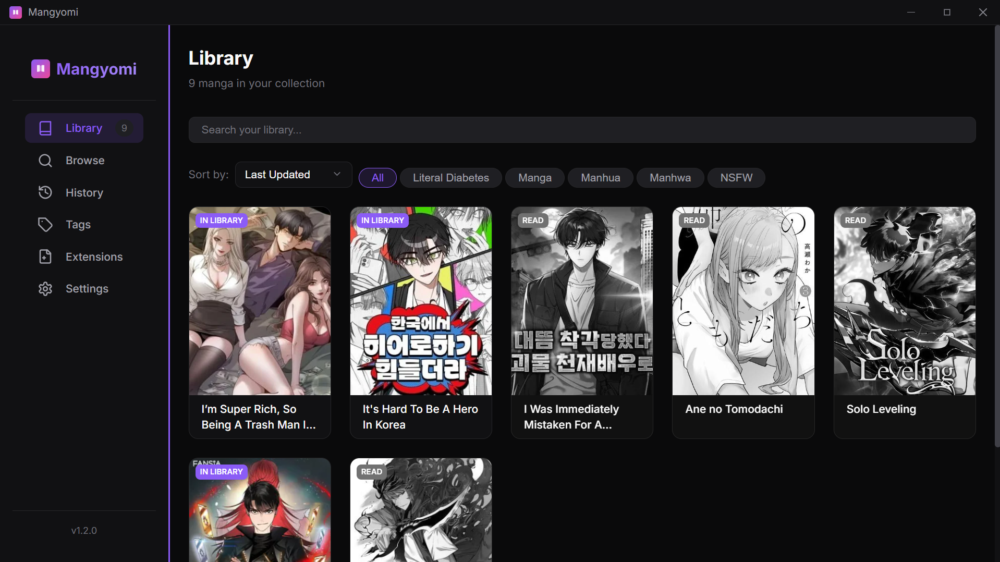
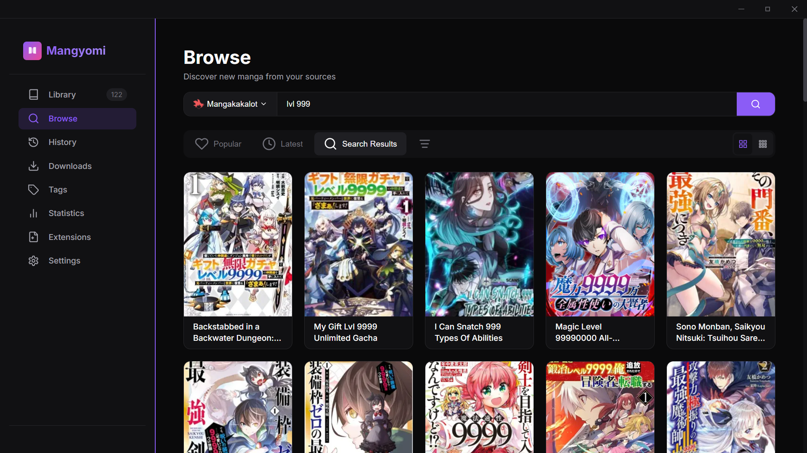
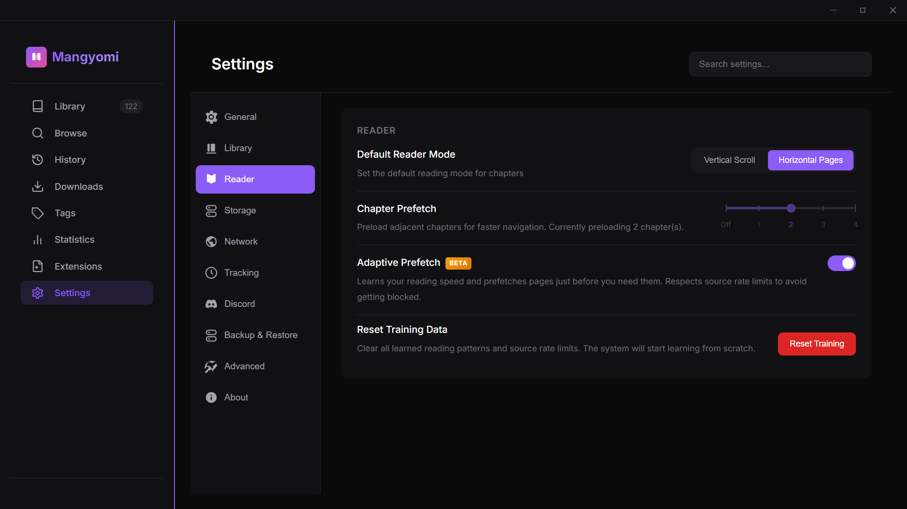
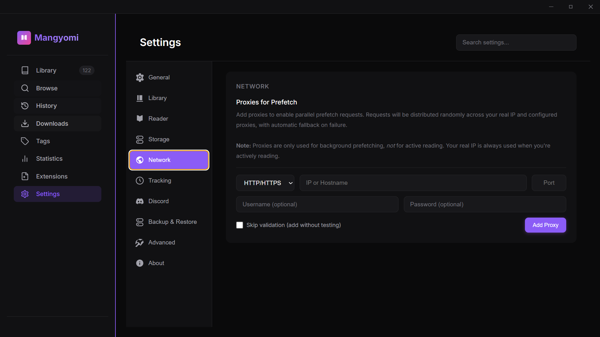
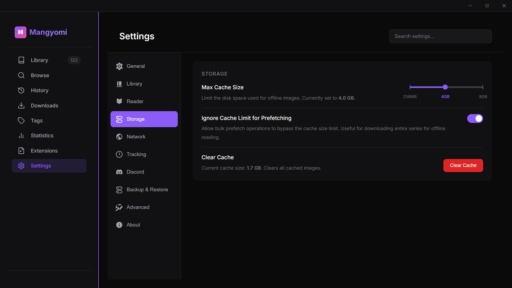
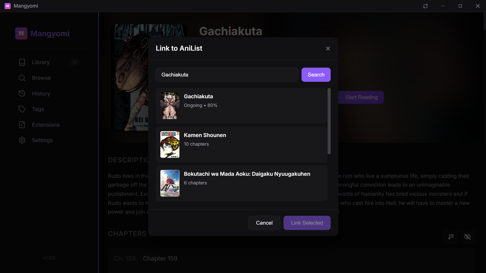
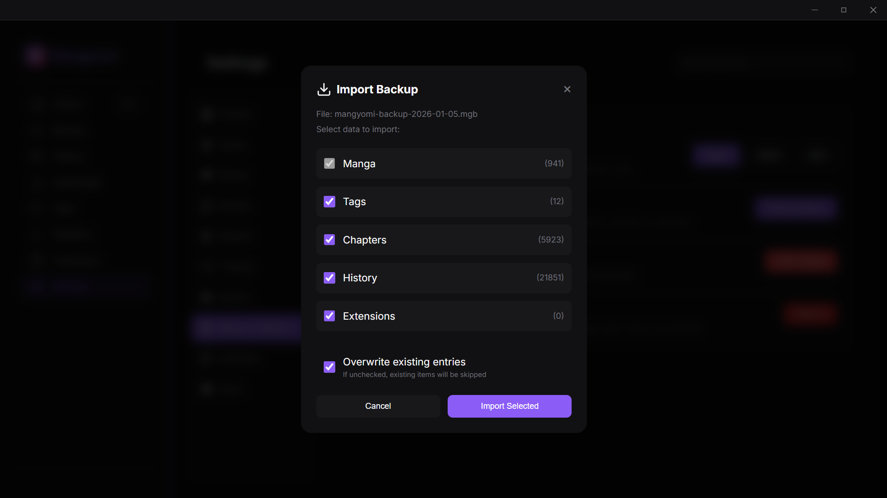

# Mangyomi 📖

A Tachiyomi-style manga reader desktop application built with Electron and React.

**Supported Platforms:** Windows, Linux

**Support:** Join our [Discord server](https://discord.gg/HnGBh5zkuh) for bug reports and support queries.

## Disclaimer

Mangyomi is a **manga reading application** that provides a platform for browsing and reading manga through third-party extensions.

### Important Notice

- **No Content Hosting**: Mangyomi does not host, store, or distribute any manga content. All content is fetched directly from third-party websites through user-installed extensions.
- **Extension Responsibility**: Extensions are developed independently and are not bundled with the core application. Users choose which extensions to install.
- **User Responsibility**: Users are responsible for ensuring their use of this application complies with local laws and the terms of service of the content sources they access.
- **Educational Purpose**: This project is provided for educational and personal use. The developers do not condone or encourage piracy.

### Copyright

If you are a copyright holder and believe content accessible through third-party extensions infringes your rights, please contact the respective website operators directly.

This program is distributed in the hope that it will be useful, but WITHOUT ANY WARRANTY. See the [LICENSE](LICENSE) file for details.



**[📸 View Full Showcase](./SHOWCASE.md)**

---

## ✨ Features

### 📚 Library Management
Organize your manga collection with custom tags and categories. Add manga to your library, track reading progress, and filter by status.


### 🔍 Browse & Search
Discover manga from multiple sources via extensions. Switch between Popular and Latest tabs, apply advanced filters, and search across all enabled sources.



### 📖 Chapter Reader
Smooth reading experience with two reading modes:
- **Vertical Scroll** - Continuous scrolling for webtoons and long-strip manga
- **Horizontal Pages** - Page-by-page navigation for traditional manga


### 📜 Reading History
Track your reading progress across all manga with lazy loading for large histories. Filter by source and search through your reading history.


### 📥 Downloads
Download chapters for offline reading. Manage your downloads queue and view download progress.


### 🏷️ Tags
Organize manga with custom colored tags for easy categorization. Bulk tag management and tag-based filtering.


### 🔌 Extension System
Install extensions directly from GitHub repositories. Enable, disable, or uninstall extensions as needed. Search through available and installed extensions.


### 🔒 Extension Sandbox
Extensions run in isolated sandboxed environments for security:
- **Isolated Execution**: Each extension runs in its own sandboxed BrowserWindow with no access to Node.js APIs
- **Domain Whitelisting**: Extensions can only fetch from domains declared in their manifest
- **No System Access**: Dangerous globals like `require`, `process`, `Buffer`, and `fs` are blocked
- **Shared Session**: Cloudflare cookies are shared across extensions for seamless challenge solving
- **Auto Cleanup**: Idle sandboxes are automatically destroyed after 5 minutes to save memory

---

## 🚀 Advanced Features

### ⚡ Smart Prefetching
Preload adjacent chapters (0-4) for faster navigation between chapters. Configure the number of chapters to prefetch based on your connection speed.

### 🧠 Adaptive Prefetch (Beta)
Machine learning-based prefetching that learns your reading speed and prefetches pages just before you need them. Respects source rate limits to avoid getting blocked.



### 🌐 Network Proxies
Configure HTTP/SOCKS4/SOCKS5 proxies for prefetch distribution. Requests are distributed randomly across your real IP and configured proxies with automatic fallback on failure.



### 💾 Cache Management
Configurable cache size limits (256MB-8GB). Option to bypass cache limits during bulk prefetch for offline reading.



---

## 🔗 Integrations

### 📉 AniList Tracking
Sync your reading progress automatically with AniList:
- **Two-way Sync**: Updates your AniList profile as you read
- **Status Updates**: Automatically changes status to "Reading" or "Completed"



### 🎮 Discord Rich Presence
Show your current reading activity on Discord with rich presence:
- **Rich Details**: Shows manga title, current chapter, and source
- **Privacy Controls**: Hide NSFW content from your status
- **Strict Mode**: Treat all content from NSFW-tagged extensions as sensitive
- **Incognito**: Toggle RPC globally


### 📦 Tachiyomi/Mihon Import
Restore your library from Tachiyomi/Mihon backup files (.tachibk, .proto.gz). Selective import with options for:
- Manga library
- Chapter progress
- Reading history



---

## ⚙️ Settings

### General
- Theme selection (Light, Dark, System)

### Library  
- NSFW content filtering (Global, Library, History, Tags)

### Reader
- Default reading mode
- Chapter prefetch settings
- Adaptive prefetch toggle

### Storage
- Cache size limits
- Clear cache option

### Network
- Proxy configuration

### Tracking
- AniList connection

### Discord
- Rich Presence toggle
- NSFW privacy settings

### Advanced
- Log level configuration
- Debug log generation
- Developer mode (extension sideloading)
- Memory monitor
- GPU status management

---

## 🛠️ Installing Extensions

1. Go to **Extensions** in the sidebar
2. Enter a GitHub repository URL (e.g., `github.com/username/mangyomi-extensions`)
3. Click **Browse** to see available extensions
4. Click **Install** on any extension you want
5. Toggle extensions on/off or uninstall as needed

### Extension Repository Format

```
my-extensions-repo/
├── extension-one/
│   ├── manifest.json
│   └── index.js
├── extension-two/
│   ├── manifest.json
│   └── index.js
```

---

## 💻 Tech Stack

### Main Application
- **Electron** - Desktop framework
- **React 18** - UI library with TypeScript
- **Vite** - Build tool
- **SQLite** - Local database (better-sqlite3)
- **Zustand** - State management

### Installer
- **Tauri** - Lightweight Rust-based installer (~12MB vs ~330MB Electron)
- **7-Zip SFX** - Self-extracting portable package
- **React** - Installer UI

---

## 🚀 Getting Started

### Prerequisites

- Node.js 18+
- npm or yarn

### Development

```bash
git clone https://github.com/Mangyomi/mangyomi-application.git
cd mangyomi
npm install
npm run dev
```

### Building

```bash
npm run electron:build
```

---

## 📄 License

GNU General Public License v3.0

## 🙏 Acknowledgments

- Inspired by [Tachiyomi](https://tachiyomi.org/)
- Built with [Electron](https://www.electronjs.org/) and [React](https://reactjs.org/)
