# Mangyomi Showcase 📸

A visual tour of Mangyomi's features and interface.

---

## 📚 Library

Organize your manga collection with custom tags, categories, and reading status tracking.

---

## 🔍 Browse Sources

Discover and search manga from multiple sources. Switch between Popular and Latest tabs, apply advanced filters.

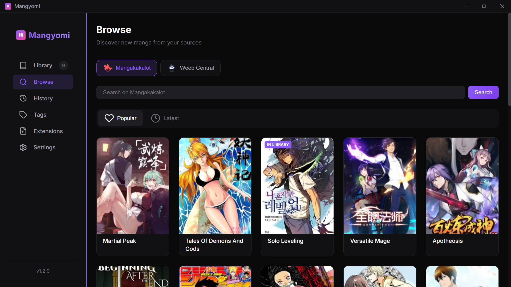

---

## 📖 Manga Details

View comprehensive manga information including cover art, description, genres, status, and complete chapter list.

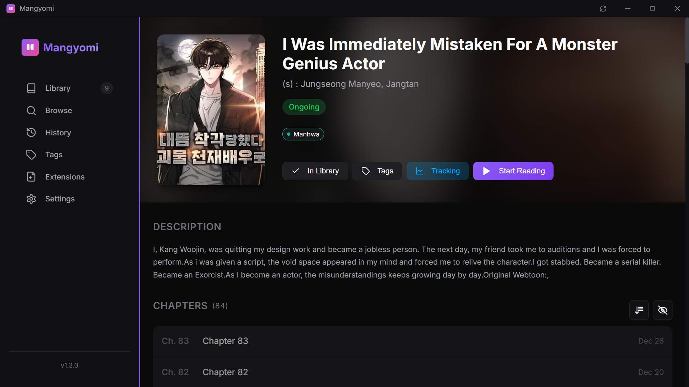

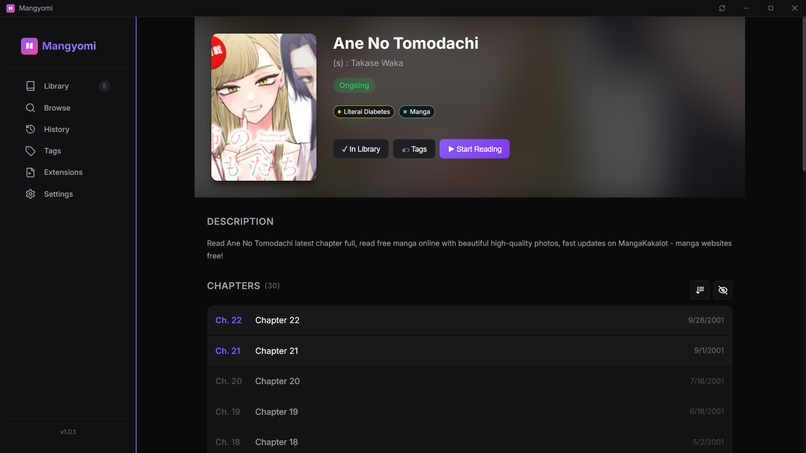

---

## 📖 Chapter Reader

### Vertical Scroll Mode
Continuous scrolling for webtoons and long-strip manga.

### Horizontal Page Mode
Page-by-page navigation with arrow keys or click navigation.

---

## 📜 Reading History

Track reading progress across all manga with source filtering and search.

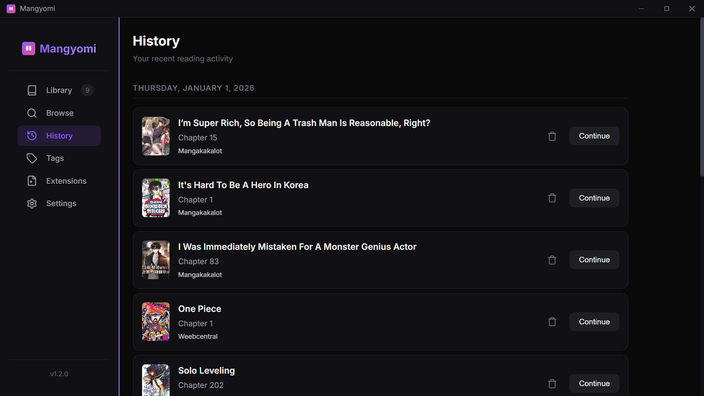

---

## 🏷️ Tags

Create custom colored tags for categorization. Bulk tag management.

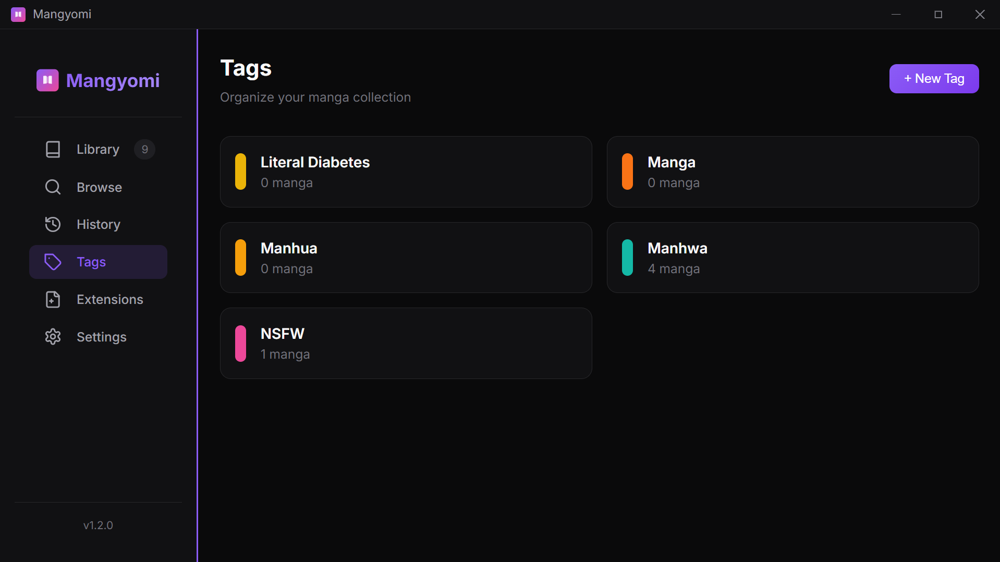

---

## 🔌 Extensions

Install and manage extensions from GitHub repositories. Search, enable/disable, and update.

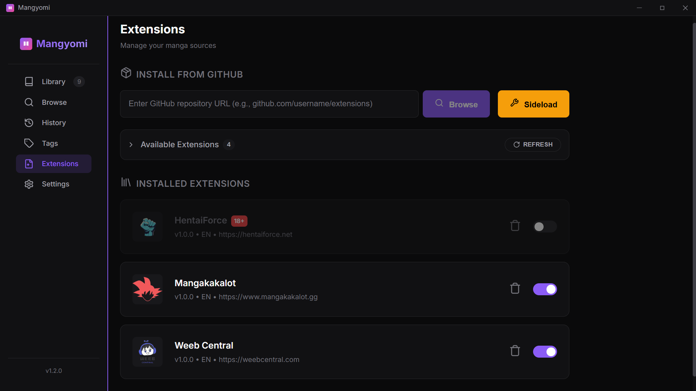

---

## 📉 AniList Tracking

Two-way sync with AniList. Automatic status updates and conflict resolution.

| Tracking Panel | Conflict Resolution |
| :---: | :---: |
|  | 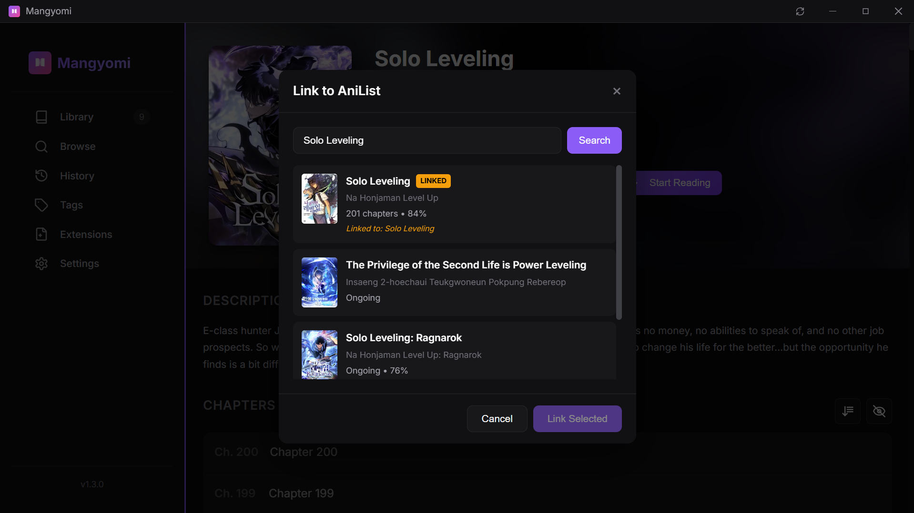 |

---

## ⚙️ Settings

Comprehensive settings for customization and privacy.

| General | Library |
| :---: | :---: |
| 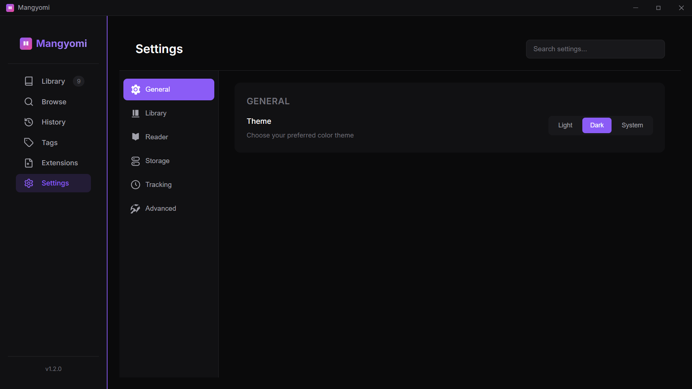 | 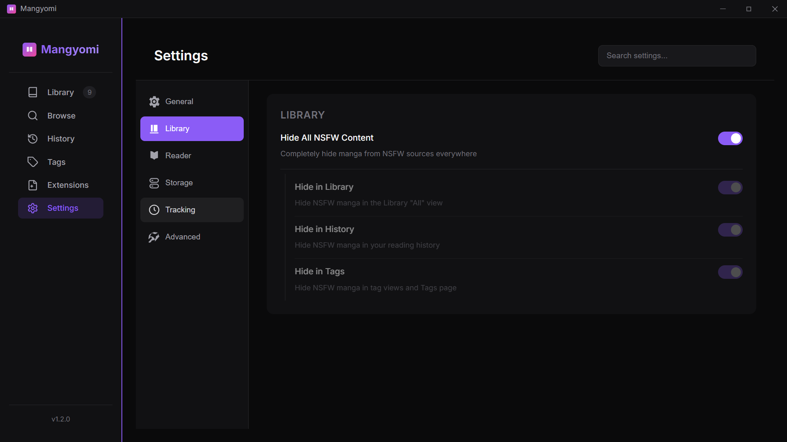 |

| Reader | Storage |
| :---: | :---: |
| 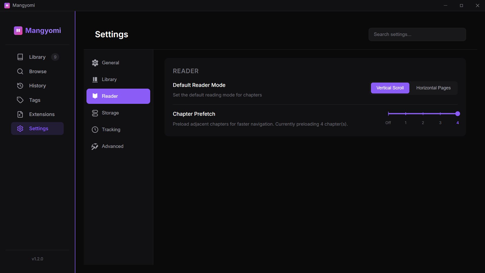 | 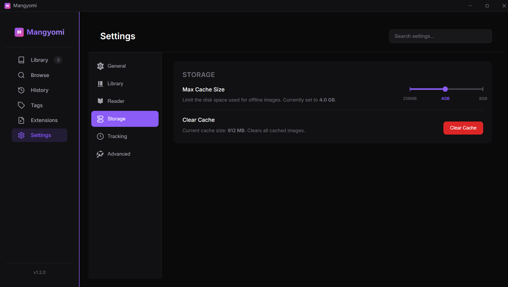 |

| Tracking | Discord |
| :---: | :---: |
| 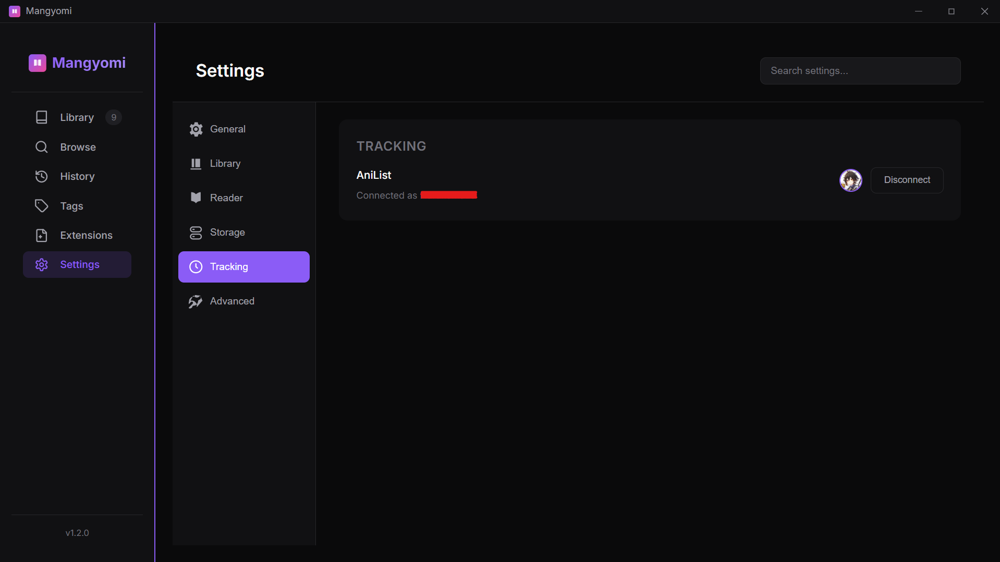 |  |

| Advanced | Network |
| :---: | :---: |
| 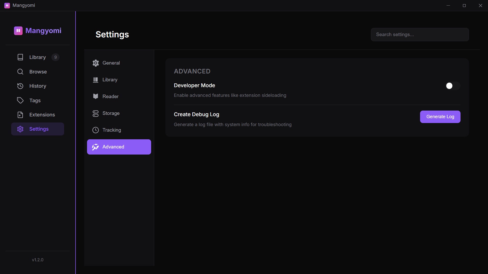 |  |

---

## 🧠 Adaptive Prefetch

ML-based prefetching that learns your reading speed and respects source rate limits.

---

## 📦 Backup & Restore

Import from Tachiyomi/Mihon backups with selective import options.

---

## 🚀 Auto Updates

Automatic update checking with stable and nightly/beta channels.

